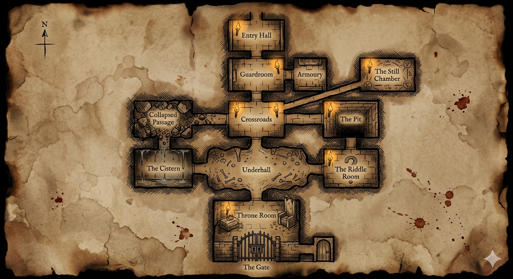

# Lore — The Sunken Crown
## Full Canon. Spoilers Throughout.

---

**STOP.**

This document contains the complete backstory of The Sunken Crown. If you have not finished the game at least once, put this down.

The game is short. The knowledge here will change how you play it, and not in a way you can undo.

Come back when you are ready.

---

## The Dungeon

Twelve rooms. One way in, one way out, and between them a layout designed by a man who understood exactly what he was protecting.

The Entry Hall sits at the top — the chute drops you there, the gates close behind you. South leads to the Guardroom and the Armoury, then further south to the Crossroads, where the dungeon opens up. Northeast of the Crossroads is the Still Chamber — the room that should not be there, the room that moves you. East is the Pit, and south of the Pit sits the Riddle Room, sealed until you answer what is carved into the wall.

West from the Crossroads runs to the Cistern, lined with old water channels and something cold. The Collapsed Passage lies north of the Cistern — rubble, darkness, skittering. South of Crossroads the Underhall opens wide, bones along the walls, the ceiling higher than it has any right to be. The Throne Room waits beyond it.

At the bottom of the map, past the Throne Room, the Gate. Two doors. One leads out.

The dungeon is not large. It was never meant to be. It was meant to be sufficient.

---

## The First King

The dungeon was built by a king whose name has been deliberately erased from every record that survived him. He is referred to here as the First King because that is what he was — the first ruler of this place, before the keep above it, before the town, before any of what stands now.

He built the dungeon as a vault. What he stored there is not known and does not matter. What matters is that he understood what he was protecting and took steps accordingly.

He was a careful man. He trusted very few people.

One of them betrayed him.

---

## The General

The man who would become the Bound King was a general in the First King's service. Decorated, trusted, given access that few others had. He had earned it — genuinely, over many years. The medal that bears his name was real once, awarded for real service. He was not always what he became.

What he became was a man who decided that possession of the crown meant the right to rule. Not inheritance, not election, not the consent of anyone else. Simply possession. The logic of it made sense to him at the time. It would not have made sense to anyone else.

He knew the First King was dying. Wounds taken in battle — wounds the general had full knowledge of, wounds he had timed his theft around. He waited until the moment was right. He went into the vault. He took the crown.

The First King caught him in the act.

---

## The Curse

Dying men have said many things in their final moments. Most of it is anger, or grief, or nothing coherent at all. The First King said something coherent.

He had perhaps ten seconds of clarity left. He used them deliberately.

The curse was not a soldier's curse — not the hot, formless anger of a man betrayed. It was something older and more precise, the kind of thing that takes preparation or comes from a very deep place. It bound the general to the dungeon, to the crown, to continued existence regardless of what was done to him. It was specific on the point of dying. He would not. He would feel everything — every wound, every year, every second of every night in that room — and he would not die.

The crown fused to his temples in the moment the curse landed. He has not removed it since. Not because he hasn't tried.

That was three hundred years ago.

---

## What He Is Now

He looks like a man in his forties. That is the age he was when it happened, and the curse that keeps him alive keeps him whole. The scars are there — the marks of every fight he has lost and recovered from, three centuries of them — but the body has not aged. The crown is the only thing that looks ancient. The metal has grown into the skin over time, or the skin has grown into the metal. After three hundred years the distinction has ceased to matter.

He does not speak. He stopped doing that a long time ago. There is nothing to say and nobody worth saying it to, and the fury that replaced his words is too old and too constant to come out as language anymore.

He fights because it marks the time. He has been beaten before. He will be beaten again. He will still be in that room when everyone who has ever entered the dungeon is dust.

He cannot leave. The curse was specific on that point too.

---

## The Crown Mechanic

The crown is on his head when he falls. It is always on his head. It has not left his head in three hundred years.

If you take it, the curse transfers. This is not something the game warns you about. The dungeon does not warn you about anything. The name of the dungeon is the only clue available — the Sunken Crown, the crown that sank beneath the earth, the king who fell — and most players do not connect it until after.

The Bound King walks out. You watch him go. You cannot follow.

You are still there when the torch goes out.

---

## The Gate

The Gate has two doors. One leads outside. One leads deeper into the dungeon, into corridors that have no exit, where the torch eventually dies and whatever was already in the dark finds you.

The correct door is randomised each run. But the tell is consistent — the correct door is always the less worn one. The wrong door is worn with the hands of everyone who stood where you are standing, looked at two identical doors, and reached for the more familiar-looking one. The instinct to choose the worn path, the used path, the path that looks like it has been chosen before, is the last thing the dungeon tests.

Most people fail it. The worn door is evidence of that.

The cleaner door is evidence that survival is possible. That someone, occasionally, noticed.

---

## The Cursed Bloodline

Lord Malachar's family has lived above the dungeon for two generations. It has changed them.

The Bound King's curse radiates outward through the stone — ambient, ancient, not directed at anyone. Malachar's grandfather built the trial, built the chute, brought the first contestants. His son continued it. Malachar continues it now. None of them chose to stop, though none of them could have articulated why if asked directly.

The Bound King does not direct this. He is not aware of it. The curse does not care about intent. It simply extends outward through the stone and the years, pulling people toward the dungeon, keeping the trial running, ensuring that contestants keep arriving.

Every contestant is the dungeon working toward its own end. What that end is — whether the crown can be lifted by the right person in the right way, whether there is a version of this that resolves — the dungeon does not say. It has been three hundred years. Whatever the First King intended, he is not here to complete it.

---

## The Medal of Valour

The medal that carries the general's name — the one that sits in the dungeon's loot pool looking like a reward — was real once. He earned it in genuine service to the First King, years before the betrayal. It predates everything that came after.

The dungeon has held it for three hundred years. It does not confer honour. It confers the permanent weight of what the man who earned it became.

SKILL -1. Applied silently. The dungeon does not explain.

---

## What You Actually Did

You went into a dungeon that has been running for three hundred years on the momentum of one man's betrayal and one dying king's precision. You fought your way through what the dungeon uses to thin the numbers. You beat something that cannot die and took what you came for.

The Bound King is already regenerating by the time you reach the stairs. He will be on his throne when the next contestant arrives. He will raise his head. He will stand.

The gold you carried out belonged to someone once. Most of it belonged to people who didn't make it. You are one of almost none.

That is what the end screen means when it says it.

---

*The Sunken Crown was written in SharpBASIC v1 — a tree-walking interpreter built from scratch as a learning project. The engine that runs this dungeon was built by hand, from first principles, by someone learning how programming languages work. If that interests you, the source is available alongside this game.*
