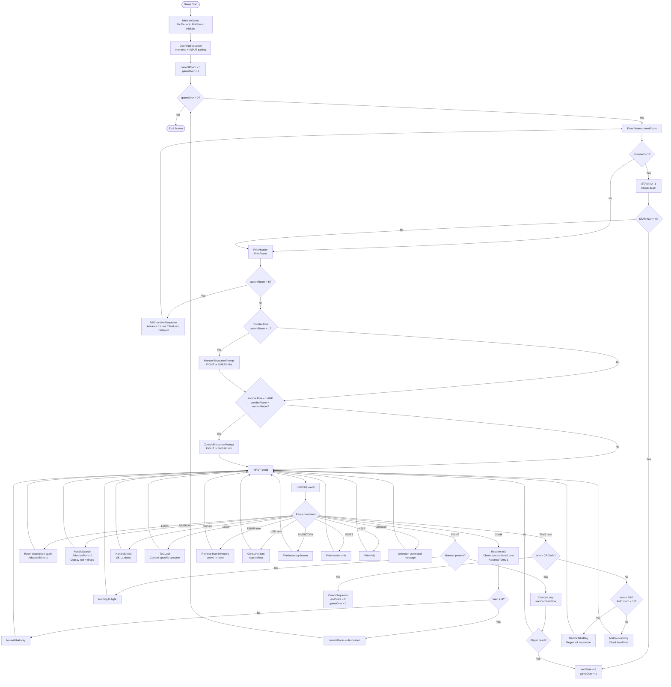
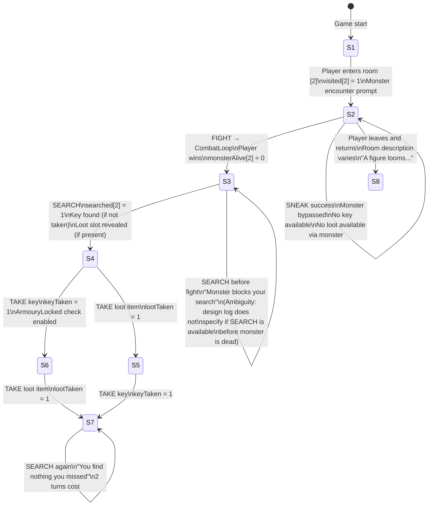

# The Sunken Crown — Technical Architecture Document

> Derived from: SharpBASIC Showcase Game — Decisions & Context Log (March 2026)  
> Language: SharpBASIC v1 — single file, global scope, no classes, no modules  
> Purpose: Implementation reference. Everything here comes from the design log.  
> Ambiguities are noted where they exist.
>
> **Updated March 2026 — All ambiguities resolved. Pre-build decisions locked.**
> **Language spec updated — SET GLOBAL, CONST, SELECT CASE, 2D arrays, CHR$ now in v1.**
> See Appendix for full resolution record.

-----

## 1. Architecture Decision Records

-----

### ADR-001: Exits Stored as Parallel Arrays, Not a 2D Table

**Status:** Accepted

**Context:**  
Rooms have between 1 and 4 exits, each with a direction and a destination room number.
The direction set is asymmetric — going NE from [4] reaches [5], but returning
“south” from [5] reaches [2], not [4]. A simple 2D grid (room × direction) cannot
represent asymmetric connections cleanly in BASIC without becoming unreadable.

**Decision:**  
Exits are stored as parallel 1D arrays indexed by a flat exit slot number,
not by room. Each exit slot stores: its owning room, its direction label
(as an integer code), and its destination room. A separate array stores
how many exits each room has, and a starting-index array allows per-room
lookups.

```
' exit slot layout (conceptual):
' exitRoom[i]   -- which room this exit belongs to
' exitDir[i]    -- direction: 1=N, 2=S, 3=E, 4=W, 5=NE
' exitDest[i]   -- destination room number
' roomExitStart[r] -- first exit slot for room r
' roomExitCount(r) -- how many exits room r has
```

Asymmetric connections are encoded directly: room [5] has one exit slot
with direction=S and destination=2. There is no “return path” logic — the
destination is simply stated.

**Consequences:**

- Asymmetric connections are first-class, not special-cased.
- The zombie wandering algorithm reads the same exit arrays the player uses —
  the design log states this explicitly and it falls out naturally here.
- Hidden exits (room [6]’s south exit to [9]) are stored in the array from
  the start; they are simply not displayed until the room has been searched.
  A `exitHidden(i)` flag array marks them.
- Total exit slots: ~25 for the 12-room map. A `DIM` of 30 is sufficient.

-----

### ADR-002: Room State as Parallel Flag Arrays, Not a State Enum

**Status:** Accepted

**Context:**  
Each room has multiple independent boolean properties: visited, searched,
monster alive/dead. In a language with classes this would be a struct or
record. SharpBASIC has neither.

**Decision:**  
Each property is its own `DIM`-ed integer array, indexed by room number (1–12).
Integer 0 = false, 1 = true throughout.

```
DIM visited[12] AS INTEGER    ' 0 = first visit, 1 = revisit
DIM searched[12] AS INTEGER   ' 0 = unsearched, 1 = exhausted
DIM monsterAlive[12] AS INTEGER ' 0 = dead/absent, 1 = present
```

**Consequences:**

- Any combination of states is representable without a combinatorial explosion.
- Adding a new per-room flag costs one `DIM` line and one array reference.
- The searched flag and visited flag are independent — a room can be revisited
  without being searched, or searched on first visit. The design log is explicit
  that these are separate.
- Monster presence is per-room. The zombie is *not* tracked here — it has its
  own position variable (see ADR-005).

-----

### ADR-003: Loot Shuffle via Fisher-Yates on a Fixed Pool Array

**Status:** Accepted

**Context:**  
Four shuffled items must be distributed across five loot slots at game startup.
One slot is always empty. The design log specifies a pool of 4 items and 5 slots.
SharpBASIC has `RND` and `INT` but no built-in shuffle. The shuffle must produce
a genuine random permutation, not a biased assignment.

**Decision:**  
Define a `lootPool` array of 5 integers (item codes 1–4, with 0 representing
“empty”). Initialise it as `[1, 2, 3, 4, 0]`. Apply a Fisher-Yates shuffle
using `RND` and `INT`. Then assign `lootPool[i]` to `slotContents[i]` — a
second array mapping slot index to item code.

```
' Shuffle lootPool[1..5] in place:
FOR i = 5 TO 2 STEP -1
    LET j = INT(RND() * i) + 1
    LET temp = lootPool[i]
    LET lootPool[i] = lootPool(j)
    LET lootPool(j) = temp
NEXT i
```

The healing potion guarantee (at least one opportunity on both routes before
the boss) is satisfied by the slot assignments: slots 1, 2, and 3 are shared
by both routes. If the Healing Potion lands in any of these three slots, the
guarantee holds regardless of which route the player takes. The shuffle is
unconstrained — the slot assignments do the work, not the shuffle logic.

**Consequences:**

- True random distribution each run.
- The guarantee is structural, not algorithmic — no post-shuffle validation needed.
- Fixed items (Antidote Vial, Bangle of Courage, Sword of Sharpness, Mouldy Bread)
  are never in the pool and are not shuffled.

-----

### ADR-004: Poison Tracked as Global Integer, Checked on Room Entry

**Status:** Accepted

**Context:**  
The Skittering Horror can poison the player. Poison inflicts 1 STAMINA damage
on each subsequent room entry until cured. This is a persistent status effect
that must survive across multiple GO commands and combat rounds.

**Decision:**  
A global integer `poisoned` (0 or 1) tracks poison status. After each successful
GO command resolves (room has changed, room description is about to print),
check `IF poisoned = 1 THEN` and apply 1 STAMINA damage before the room text.

The Antidote Vial clears `poisoned` to 0 when USEd.

The design log states that overburdened STAMINA loss does not trigger the poison
check — these are separate damage sources. The poison check fires only on room
entry (GO command), not on other STAMINA-reducing events.

**Ambiguity noted:** The design log does not specify whether poison damage fires
before or after the room description and monster encounter check. Recommended:
fire it immediately on entry, before description, so the player sees the cost
before deciding their action. This matches the “each subsequent room entry” phrasing.

**Consequences:**

- Simple to implement; simple to cure.
- Poison check is in one place: the post-GO room entry handler.
- The Skittering Horror’s poison trigger (roll 1d6, poison on 4+, only on rounds
  the Horror wins) is in the combat loop, not the room entry handler.

-----

### ADR-005: Zombie Position as a Single Integer, Wandering via Exit Array

**Status:** Accepted

**Context:**  
The zombie is the only entity that moves independently. It has no pathfinding,
no awareness of the player’s position, and no fixed home room. It must use the
same exit structure as the player to feel consistent with the dungeon’s rules.

**Decision:**  
A single integer `zombieRoom` stores the zombie’s current location (1–12, or 0
for unspawned). Each turn, `SUB WanderZombie()` picks a random valid exit from
`zombieRoom` using the exit arrays (ADR-001), excluding rooms [5], [8], and [11].
If all exits from the current room lead only to excluded rooms, the zombie does
not move that turn.

```
' Conceptual wandering logic:
LET validExits = 0
FOR i = roomExitStart[zombieRoom] TO roomExitStart[zombieRoom] + roomExitCount[zombieRoom] - 1
    IF exitDest[i] <> 5 AND exitDest[i] <> 8 AND exitDest[i] <> 11 THEN
        LET validExits = validExits + 1
    END IF
NEXT i
' then pick one of the valid exits at random
```

**Consequences:**

- The zombie naturally respects the same map topology as the player.
- The zombie can enter any room except [5], [8], [11] — the exclusion list is
  checked at movement time, not at spawn time.
- Encounter check: after each player move, `IF zombieSpawned = 1 AND zombieRoom = currentRoom`.
- SEARCH costs 2 turns — `WanderZombie` is called twice during a SEARCH action,
  giving the zombie two movement rolls while the player’s back is turned.

-----

### ADR-006: Crown Mechanic Bypasses Inventory — Immediate Trigger on TAKE CROWN

**Status:** Accepted

**Context:**  
The crown is the most important single item in the game. Taking it transfers the
curse and ends the run. It must never enter the inventory — no slot is consumed,
no weight is added, no hard limit interacts with it. It fires immediately on the
command, regardless of carry state.

**Decision:**  
`TAKE CROWN` is a special-cased command intercepted before the general TAKE
handler. When detected:

1. The curse sequence plays immediately.
2. `gameOver = 1` is set with a distinct end-state code (e.g., `endState = 2`
   for “became the Bound King”, vs `endState = 1` for normal win).
3. The main game loop exits.

No inventory array is touched. No slot count is checked.

**Consequences:**

- The crown cannot be dropped, used, or traded — it is never in inventory.
- A player with 0 inventory slots remaining can still take the crown.
  This is intentional — greed has no mechanical protection.
- The command parser must check for `TAKE CROWN` before the general TAKE
  handler to prevent the general handler from attempting a slot assignment.

-----

### ADR-007: Asymmetric Room [4]→[5]→[2] Connection via Exit Destination Override

**Status:** Accepted

**Context:**  
Room [5] The Still Chamber has no navigable exits — the player is teleported
on entry. The teleport mechanic replaces normal exit-based navigation for this
room. The “return south from [5] reaches [2]” asymmetry is the centrepiece
living-dungeon moment.

**Decision:**  
Room [5] is handled as a special case in the room entry handler. When
`currentRoom = 5`, the normal command loop does not run. Instead:

1. Print the Still Chamber flavour text.
2. Advance 3 turns (call `WanderZombie` three times, fire atmospheric event
   checks three times).
3. Call `TestLuck()`.
4. Based on the result, pick randomly from the lucky or unlucky pool.
5. Set `currentRoom` to the chosen destination.
6. Print the waking text, then fall through to normal room entry for the
   destination room.

The [4]→[5] exit is stored in the exit array with direction NE and destination 5.
There is no exit stored in room [5]’s exit list that the player can use — the
room simply has `roomExitCount(5) = 0`. The asymmetric “south returns to [2]”
is never stored as an exit; it is handled by the teleport mechanic placing the
player in a pool that may include room [2].

**Ambiguity noted:** The design log says “Return south from [5] deposits the
player in [2]”. The still chamber mechanic teleports based on a luck roll to a
pool, not a fixed destination. These two descriptions appear to conflict. The
luck-roll mechanic is the fully designed system; the “return south = room [2]”
is likely the narrative framing (the player wakes up in [2] on a lucky outcome)
rather than a guaranteed mechanical rule. The lucky pool includes [1] Entry Hall
and [3] Armoury — not [2] Guardroom. This is a genuine ambiguity in the log.
**Recommend confirming with the designer before implementation.**

-----

### ADR-008: Still Chamber Lucky/Unlucky Pool Selection via RND Index

**Status:** Accepted

**Context:**  
After the luck roll in [5], the destination is chosen randomly from one of two
pools. The pools have different sizes (2 lucky, 5 unlucky). Monster state must
be checked — landing on a dead monster is a normal room entry, not a fight.

**Decision:**  
Store pool rooms as small fixed arrays. Select randomly by index.

```
DIM luckyPool[2] AS INTEGER   ' [1, 3]
DIM unluckyPool[5] AS INTEGER ' [6, 7, 8, 9, 10]
```

After selecting a destination, do not reroll if the monster is dead. Simply
set `currentRoom` to the destination and let normal room entry logic handle
the monster-present check. If `monsterAlive[dest] = 0`, the room is entered
normally. The pool selection is not filtered — “the dungeon put you there
regardless” (design log).

**Consequences:**

- Landing on room [8] (Riddle Room) when it is already solved: the design log
  states “doors are open and you pass through.” This requires a `riddleSolved`
  flag that the Riddle Room handler checks to bypass the death trap.

-----

### ADR-009: Riddle Room Death Trap — Hard Block on Wrong Answer

**Status:** Accepted

**Context:**  
Room [8] accepts only LEFT or RIGHT. Any other input is held in the room.
Wrong answer = instant death, no recovery. No SKILL check, no LUCK test.
The riddle and correct door are assigned at startup, fixed for the run.

**Decision:**  
At game startup, roll `INT(RND * 8) + 1` to select a riddle index. Roll
`INT(RND * 2) + 1` to assign correct door (1=LEFT, 2=RIGHT). Store as
`riddleIndex` and `riddleCorrectDoor` globals.

The Riddle Room has its own inner INPUT loop that accepts only “LEFT” or “RIGHT”
(after `UPPER$` normalisation). Any other input prints the holding text and
loops. On correct input, set `riddleSolved = 1` and advance to [10]. On
incorrect input, trigger death sequence and set `endState = 3`.

**Consequences:**

- The riddle text is selected from a string-based lookup by index. In BASIC
  without arrays of strings, this is an `IF riddleIndex = 1 THEN ... ELSE IF riddleIndex = 2 THEN ...` chain. Verbose but correct.
- `riddleSolved` is checked by the Still Chamber pool handler (ADR-008) to
  allow pass-through on unlucky teleport.

-----

### ADR-010: Terror as Temporary Stat Modifier Applied Before Combat, Restored After

**Status:** Accepted

**Context:**  
Terror applies a SKILL penalty (and for full Terror, a LUCK penalty) for the
duration of a combat encounter. Lesser terror only applies for round one. The
original stat values must be restored correctly after the fight ends.

**Decision:**  
Before entering the combat loop, if the relevant terror flag is set:

```
IF terrorActive = 1 THEN
    SET GLOBAL skill = skill - 2
    SET GLOBAL luck = luck - 1
END IF
```

After the combat loop exits (monster dead or player dead), restore:

```
IF terrorActive = 1 THEN
    SET GLOBAL skill = skill + 2
    SET GLOBAL luck = luck + 1
END IF
```

For lesser terror (Skittering Horror), the SKILL modifier is applied before
round 1 and restored at the start of round 2 via a `firstRound` flag inside
the combat loop.

**Consequences:**

- Stat restoration is explicit and auditable — the design log specifically
  calls this out as a requirement.
- If the player dies during a terror encounter, the restoration code is never
  reached. This is correct — the run is over.
- The Bangle of Courage check happens before any stat modification: if
  `hasItem[BANGLE] = 1` then `terrorActive` is never set to 1.

**SET GLOBAL in terror handler:** All stat modifications in the terror handler
use `SET GLOBAL` since they run inside `BoundKingSequence` (a SUB).

-----

## 2. State Variable Map

All variables are global unless noted as parameter-only. BOOLEAN is represented
as INTEGER (0 = false, 1 = true).

**SET GLOBAL rule:** All global variables listed in this map must be mutated from
inside SUBs and FUNCTIONs using `SET GLOBAL name = expression`, not `LET`.
Using `LET` inside a SUB creates a local variable and leaves the global unchanged.
`SET GLOBAL` requires the variable to already exist in global scope.
Constants declared with `CONST` cannot be targeted by `SET GLOBAL`.

**CONST rule:** Direction codes, item codes, array size limits, and fixed thresholds
are declared with `CONST` at the top of the file. They are read-only throughout
the program. Any attempt to reassign them with `LET` or `SET GLOBAL` is a runtime error.

**Paging model:**
The game targets a 30-row terminal. Chrome occupies 10 rows (two separators, header,
location line, blank lines, exits, prompt), leaving 20 content rows per screen.

```
CONST SCREEN_HEIGHT = 30    ' total terminal rows
CONST CONTENT_ROWS = 20     ' rows available for content after chrome
```

Text blocks exceeding 20 lines are broken with `CALL Pause()` at authored break
points marked `[PAUSE]` in the content asset file. Currently only the win sequence
(29 lines) requires a pause — after *"The guards don't move."* before the quoted
speech. All other text blocks fit within 20 lines.

`SUB Pause()` prints `"  Press ENTER to continue."` and waits for INPUT.
No line counting. No automatic paging. Pauses are explicit and authored.

### Player Stats

|Variable       |Type   |Represents                          |Set by                         |Read by                               |Valid range     |
|---------------|-------|------------------------------------|-------------------------------|--------------------------------------|----------------|
|`skill`        |INTEGER|Current SKILL stat                  |Startup roll, terror mod, items|Combat, sneak, terror handler         |1–12 (practical)|
|`startSkill`   |INTEGER|Starting SKILL (for reference only) |Startup roll                   |End screen                            |7–12            |
|`stamina`      |INTEGER|Current STAMINA                     |Startup roll, damage, healing  |Combat, death check, atmosphere events|0–24 (practical)|
|`startStamina` |INTEGER|Starting STAMINA (healing cap)      |Startup roll                   |Healing Potion USE handler            |14–24           |
|`minStamina`   |INTEGER|Lowest STAMINA reached this run     |Any STAMINA reduction          |End screen                            |0–24            |
|`luck`         |INTEGER|Current LUCK                        |Startup roll, luck drain, tests|TestLuck(), terror handler, end screen|0–12 (practical)|
|`luckTestCount`|INTEGER|Number of times LUCK has been tested|TestLuck()                     |End screen                            |0–n             |

### Inventory

|Variable      |Type   |Represents                          |Set by               |Read by                            |Valid range     |
|--------------|-------|------------------------------------|---------------------|-----------------------------------|----------------|
|`invCount`    |INTEGER|Number of items currently carried   |TAKE, DROP handlers  |All item checks, overburdened logic|0–4             |
|`inventory[4]`|INTEGER|Item code in each slot (0 = empty)  |TAKE, DROP handlers  |USE handler, display, checks       |0–11 (item codes)|
|`poisoned`    |INTEGER|Whether player is currently poisoned|Horror combat loop   |Room entry handler                 |0 or 1          |
|`overburdened`|INTEGER|Whether invCount = 4                |Derived from invCount|GO handler, combat loop            |0 or 1          |

**Item codes — locked (Decision 5):**
0 = empty slot, 1 = Healing Potion, 2 = Lucky Charm, 3 = Armour Shard,
4 = Dark Bread, 5 = Medal of Valour, 6 = Antidote Vial, 7 = Bangle of Courage,
8 = Sword of Sharpness, 9 = Mouldy Bread, 10 = Guardroom Key, 11 = Gold Bag.

Items are stored as INTEGER codes. Display names are returned by
`FUNCTION ItemName(code AS INTEGER) AS STRING` using SELECT CASE.

### Room and Navigation

|Variable           |Type   |Represents                                  |Set by                            |Read by                          |Valid range|
|-------------------|-------|--------------------------------------------|----------------------------------|---------------------------------|-----------|
|`currentRoom`      |INTEGER|Player’s current room (1–12)                |GO handler, Still Chamber, startup|All room-based logic             |1–12       |
|`visited[12]`      |INTEGER|Whether room r has been entered before      |Room entry handler                |Room description selector        |0 or 1     |
|`searched[12]`     |INTEGER|Whether room r has been searched            |SEARCH handler                    |SEARCH handler, loot display     |0 or 1     |
|`monsterAlive[12]` |INTEGER|Whether the fixed monster in room r is alive|Combat end handler                |Room entry, encounter check      |0 or 1     |
|`exitDir[30]`     |INTEGER|Owning room for each exit slot              |Initialisation                    |Navigation handler               |1–12       |
|`exitDir[30]`      |INTEGER|Direction code for each exit slot           |Initialisation                    |Navigation handler, display      |1–5        |
|`exitDest[30]`     |INTEGER|Destination room for each exit slot         |Initialisation                    |Navigation handler, zombie wander|1–12       |
|`exitHidden[30]`   |INTEGER|Whether exit is hidden until SEARCH         |Initialisation                    |Exit display handler             |0 or 1     |
|`roomExitStart[12]`|INTEGER|Index of first exit slot for room r         |Initialisation                    |Navigation, zombie wander        |1–30       |
|`roomExitCount[12]`|INTEGER|Number of exits for room r                  |Initialisation                    |Navigation, zombie wander        |0–4        |

### Loot and Items

|Variable         |Type   |Represents                             |Set by            |Read by                     |Valid range         |
|-----------------|-------|---------------------------------------|------------------|----------------------------|--------------------|
|`slotContents[6]`|INTEGER|Item code in each loot slot (0 = empty)|Startup shuffle   |SEARCH handler, TAKE handler|0–5 (shuffled item codes, 0=empty)|
|`slotTaken[6]`   |INTEGER|Whether loot slot has been collected   |TAKE handler      |SEARCH handler              |0 or 1              |
|`armouryLocked` |INTEGER|Whether Armoury chest is still locked  |TAKE handler (key)|SEARCH handler in room [3]  |0 or 1              |

**Note:** `armouryLocked` can be derived from `hasItem[KEY]` being false after the
Brute has been killed and searched. A dedicated flag is cleaner.

### Zombie

|Variable       |Type   |Represents                            |Set by               |Read by                        |Valid range|
|---------------|-------|--------------------------------------|---------------------|-------------------------------|-----------|
|`zombieSpawned`|INTEGER|Whether zombie has entered the dungeon|Atmospheric event #11|WanderZombie, encounter check  |0 or 1     |
|`zombieAlive`  |INTEGER|Whether zombie is still alive         |Combat end handler   |Encounter check, WanderZombie  |0 or 1     |
|`zombieRoom`   |INTEGER|Zombie’s current room                 |WanderZombie, spawn  |Encounter check, Presence event|1–12       |

### Game Flow

|Variable     |Type   |Represents                                     |Set by                 |Read by                         |Valid range                                      |
|-------------|-------|-----------------------------------------------|-----------------------|--------------------------------|-------------------------------------------------|
|`turns`      |INTEGER|Total turns elapsed                            |Turn-advancing commands|Atmospheric events, zombie spawn|0–n                                              |
|`gameOver`   |INTEGER|Whether the game has ended                     |Death/win handlers     |Main WHILE condition            |0 or 1                                           |
|`endState`   |INTEGER|How the game ended                             |Various handlers       |End screen selector             |1=win, 2=became king, 3=riddle, 4=gate, 5=stamina|
|`goldBags`   |INTEGER|Bags of gold taken from Throne Room            |TAKE BAG handler       |End screen                      |0–4                                              |
|`secondFight`|INTEGER|Whether Bound King has been beaten once already|Boss combat handler    |Boss room handler               |0 or 1                                           |

### Riddle Room

|Variable           |Type   |Represents                     |Set by             |Read by                           |Valid range|
|-------------------|-------|-------------------------------|-------------------|----------------------------------|-----------|
|`riddleIndex`      |INTEGER|Which riddle is active this run|Startup            |Riddle Room display               |1–8        |
|`riddleCorrectDoor`|INTEGER|Correct door (1=LEFT, 2=RIGHT) |Startup            |Riddle Room answer handler        |1 or 2     |
|`riddleSolved`     |INTEGER|Whether riddle has been solved |Riddle Room handler|Still Chamber pool, room [8] entry|0 or 1     |

### The Gate

|Variable         |Type   |Represents                    |Set by |Read by     |Valid range|
|-----------------|-------|------------------------------|-------|------------|-----------|
|`gateCorrectDoor`|INTEGER|Correct door (1=LEFT, 2=RIGHT)|Startup|Gate handler|1 or 2     |

### Boss — Bound King

|Variable        |Type   |Represents                             |Set by                       |Read by               |Valid range|
|----------------|-------|---------------------------------------|-----------------------------|----------------------|-----------|
|`kingStamina`   |INTEGER|Bound King’s current STAMINA this fight|Boss room entry, second fight|Boss combat loop      |0–24       |
|`kingSkill`     |INTEGER|Bound King’s SKILL (fixed per run)     |Boss room entry              |Boss combat loop      |10–15      |
|`crownAvailable`|INTEGER|Whether SEARCH has revealed the crown  |SEARCH in room [11]          |Command parser in [11]|0 or 1     |

-----

## 3. Subroutine Call Tree

```
MAIN PROGRAM
│
├── [Startup]
│   ├── SUB InitialiseGame()
│   │   ├── SUB InitExits()           ' populate exit arrays
│   │   ├── SUB InitMonsters()        ' set all monsterAlive() = 1
│   │   ├── SUB ShuffleLoot()         ' Fisher-Yates on lootPool
│   │   └── SUB RollStartingStats()
│   │       └── FUNCTION RollDice(n AS INTEGER) AS INTEGER
│   ├── SUB OpeningSequence()         ' narrative + INPUT pacing
│   └── currentRoom = 1
│
├── [Main Game Loop] WHILE gameOver = 0
│   ├── SUB EnterRoom(roomId AS INTEGER)
│   │   ├── IF poisoned: apply damage, check death
│   │   ├── SUB PrintHeader()
│   │   ├── SUB PrintRoom(roomId AS INTEGER)
│   │   │   └── SUB PrintContextualHint(roomId AS INTEGER)
│   │   ├── IF roomId = 5: SUB StillChamberSequence()
│   │   │   ├── SUB AdvanceTurns(3)
│   │   │   │   └── [calls event checks, WanderZombie 3×]
│   │   │   ├── FUNCTION TestLuck() AS INTEGER
│   │   │   └── SUB TeleportPlayer()
│   │   └── IF monsterAlive[roomId]: SUB MonsterEncounterPrompt(roomId)
│   │
│   ├── SUB HandleZombieEncounter()   ' if zombieRoom = currentRoom
│   │   └── → leads to SUB CombatLoop(...)
│   │
│   ├── INPUT cmd$
│   ├── LET cmd$ = UPPER$(cmd$)
│   │
│   └── SUB DispatchCommand(cmd$ AS STRING)
│       ├── "GO ..." → SUB HandleGo(direction AS INTEGER)
│       │   ├── resolve exit destination
│       │   ├── apply overburdened STAMINA cost
│       │   ├── SUB AdvanceTurns(1)
│       │   └── SUB EnterRoom(newRoom)  [recursive via loop]
│       │
│       ├── "LOOK" → SUB HandleLook()
│       │   └── SUB AdvanceTurns(1)
│       │
│       ├── "SEARCH" → SUB HandleSearch()
│       │   ├── SUB AdvanceTurns(2)
│       │   └── SUB DisplaySearchResults(currentRoom)
│       │
│       ├── "FIGHT" → SUB CombatLoop(roomId AS INTEGER)
│       │   ├── [see Combat Flow Diagram]
│       │   └── returns when monster dead or player dead
│       │
│       ├── "SNEAK" → SUB HandleSneak()
│       │   └── FUNCTION RollDice(n) AS INTEGER
│       │
│       ├── "LUCK" → FUNCTION TestLuck() AS INTEGER
│       │
│       ├── "TAKE ..." → SUB HandleTake(item$ AS STRING)
│       │   ├── special: "TAKE CROWN" → SUB CrownSequence()
│       │   ├── special: "TAKE BAG" (room [11]) → SUB HandleTakeBag()
│       │   │   └── FUNCTION RollDice(n) AS INTEGER
│       │   └── general: add to inventory, check overburdened
│       │
│       ├── "DROP ..." → SUB HandleDrop(item$ AS STRING)
│       │
│       ├── "USE ..." → SUB HandleUse(item$ AS STRING)
│       │
│       ├── "INVENTORY" → SUB PrintInventoryScreen()
│       │   └── SUB PrintHeader()
│       │
│       ├── "STATS" → SUB PrintHeader()
│       │
│       └── "HELP" → SUB PrintHelp()
│
├── [Game End]
│   └── SUB PrintEndScreen()
│
└── [Support Functions]
    ├── FUNCTION RollDice(n AS INTEGER) AS INTEGER
    ├── FUNCTION TestLuck() AS INTEGER
    │   └── FUNCTION RollDice(2) AS INTEGER
    ├── FUNCTION AttackStrength(statSkill AS INTEGER) AS INTEGER
    │   └── FUNCTION RollDice(2) AS INTEGER
    ├── SUB WanderZombie()
    ├── SUB AdvanceTurns(n AS INTEGER)
    │   ├── turns = turns + n
    │   ├── [n × WanderZombie if zombieAlive]
    │   └── [n × atmospheric event probability checks]
    ├── SUB PrintHeader()
    └── SUB PrintSeparator()
```

**Key signatures:**

**Note on SELECT CASE:** Multi-branch dispatch (room names, item names, riddle text,
atmospheric events, command routing) uses `SELECT CASE` throughout. This replaces
the nested IF/ELSE chains that would otherwise be required. See spec §7.4.

**Note on 2D arrays:** The exit map uses a 2D array for room-to-exit data where
the structure is regular. Parallel 1D arrays are used where the structure is
irregular (per ADR-001). Both patterns coexist in the codebase.

```
FUNCTION RollDice(n AS INTEGER) AS INTEGER
    ' Sums n d6 rolls. Single source of all randomness.

FUNCTION TestLuck() AS INTEGER
    ' Returns 1 (lucky) or 0 (unlucky). Decrements luck regardless.

FUNCTION AttackStrength(statSkill AS INTEGER) AS INTEGER
    ' Returns RollDice(2) + statSkill

SUB CombatLoop(monsterSkill AS INTEGER, monsterStamina AS INTEGER,
               hasArmour AS INTEGER, hasRegen AS INTEGER,
               hasLuckDrain AS INTEGER, hasLesserTerror AS INTEGER,
               hasPoison AS INTEGER, isBoss AS INTEGER,
               searchInterrupt AS INTEGER)
    ' Parameterised combat — all monster special flags passed in.
    ' searchInterrupt = 1 adds SKILL -1 to round 1 (additive with Lesser Terror).
    ' Boss-specific mechanics (Crushing Blow, Terror) handled by isBoss flag
    ' and pre-combat setup, not inside this SUB.
    ' All writes to global state (stamina, skill, luck, etc.) use SET GLOBAL.

SUB WanderZombie()
    ' Moves zombie one step via exit array, respecting exclusion list.

SUB AdvanceTurns(n AS INTEGER)
    ' Advances turn counter and fires per-turn events n times.
```

-----

## 4. Game Loop Flow Diagram



-----

## 5. Combat Flow Diagram

The combat loop is parameterised. Monster-specific mechanics are handled as
conditional branches, controlled by flag parameters passed to `CombatLoop`.

```mermaid
flowchart TD
    START([Enter CombatLoop]) --> SETUP[Set round = 1\nSet firstRound = 1\nSet terrorActive based on monster type]

    SETUP --> TERROR{isBoss AND\nNOT hasBangle?}
    TERROR -- Yes --> T1[skill = skill - 2\nluck = luck - 1\nterrorActive = 1]
    TERROR -- No --> LOOP

    T1 --> LOOP

    LOOP --> LUCKDRAIN{hasLuckDrain = 1?}
    LUCKDRAIN -- Yes --> LD1[luck = luck - 1]
    LUCKDRAIN -- No --> REGEN

    LD1 --> REGEN
    REGEN{hasRegen = 1?} -- Yes --> R1[monsterStamina = monsterStamina + 1\ncap at startMonsterStamina]
    REGEN -- No --> LESSER
    R1 --> LESSER

    LESSER{hasLesserTerror = 1\nAND firstRound = 1\nAND NOT hasBangle?} -- Yes --> LT1[skill = skill - 1\nlesserPenaltyActive = 1]
    LESSER -- No --> ATTACK
    LT1 --> ATTACK

    ATTACK[playerAttack = AttackStrength skill\nmonsterAttack = AttackStrength monsterSkill]

    ATTACK --> COMPARE{playerAttack vs\nmonsterAttack}

    COMPARE -- playerAttack > monsterAttack --> PHIT[Player wins round]
    COMPARE -- monsterAttack > playerAttack --> MHIT[Monster wins round]
    COMPARE -- Equal --> TIE[Tie — no damage\nprint tie text]
    TIE --> ENDROUND

    PHIT --> ARMOUR{hasArmour = 1?}
    ARMOUR -- Yes --> ARM1[damage = MAX 1 monsterStamina - 1]
    ARMOUR -- No --> ARM2[monsterStamina = monsterStamina - 2]
    ARM1 --> MCHECK
    ARM2 --> MCHECK

    MHIT --> OVERBURD{overburdened = 1?}
    OVERBURD -- Yes --> OB1[baseDamage = 3]
    OVERBURD -- No --> OB2[baseDamage = 2]
    OB1 --> CRUSHING
    OB2 --> CRUSHING

    CRUSHING{isBoss AND\nmonsterAttack - playerAttack >= 3?} -- Yes --> CR1[baseDamage = 4]
    CRUSHING -- No --> SWORD

    CR1 --> SWORD
    SWORD{hasSwordOfSharpness\nIN inventory?} -- Yes --> SW1[Note: Sword has no combat effect on player damage — only on player's hits to armoured monsters\nno change here]
    SWORD -- No --> APPLYDMG

    SW1 --> APPLYDMG
    APPLYDMG[stamina = stamina - baseDamage\nUpdate minStamina if lower]

    APPLYDMG --> POISON{hasPoison = 1\nAND ROUND WON BY MONSTER?}
    POISON -- Yes --> P1[Roll 1d6\nIF >= 4: poisoned = 1]
    POISON -- No --> PCHECK

    P1 --> PCHECK

    MCHECK{monsterStamina <= 0?} -- Yes --> MDIE[Monster dead\nmonsterAlive room = 0\nprint death text]
    MCHECK -- No --> PCHECK

    MDIE --> RESTORE

    PCHECK{stamina <= 0?} -- Yes --> PDIE[Player dead\nendState = 5\ngameOver = 1]
    PCHECK -- No --> ENDROUND

    ENDROUND --> RESTORELESSER{lesserPenaltyActive = 1?}
    RESTORELESSER -- Yes --> RL1[skill = skill + 1\nlesserPenaltyActive = 0]
    RESTORELESSER -- No --> NEXTRND

    RL1 --> NEXTRND
    NEXTRND[round = round + 1\nfirstRound = 0\nAdvanceTurns 1\nPrintCombatFrame]

    NEXTRND --> BOTHCHECK{gameOver = 1 OR\nmonsterAlive room = 0?}
    BOTHCHECK -- Yes --> RESTORE
    BOTHCHECK -- No --> LOOP

    RESTORE --> TERRORCHECK{terrorActive = 1?}
    TERRORCHECK -- Yes --> TR1[skill = skill + 2\nluck = luck + 1\nterrorActive = 0]
    TERRORCHECK -- No --> DONE
    TR1 --> DONE

    DONE([Return from CombatLoop])
```



**Notes on special cases not in the diagram:**

- **Sword of Sharpness** reduces damage *dealt to armoured monsters* by 1 additional
  point (so armoured monsters take minimum 1 instead of minimum 0 with the sword, or
  the sword negates the armour’s damage reduction). The design log states the Armoured
  mechanic “rewards having the Sword of Sharpness” but does not specify the exact
  interaction. **Ambiguity noted: confirm exact sword + armour interaction.**
- **Boss second fight:** If the Bound King regenerates during the gold mechanic
  and the player fights again, `CombatLoop` is called a second time. `secondFight = 1`
  suppresses post-fight gold collection. Monster stamina is rerolled, skill is unchanged.
- **Hollow Mage luck drain** fires at the *start* of each round, before attack rolls.
  If luck reaches 0, tests simply auto-fail; the drain still fires but cannot go below 0.

-----

## 6. Room State Machine — Guardroom [2]

Room [2] has a fixed monster (Guardroom Brute), a key drop (found on SEARCH after
combat), an east exit to the locked Armoury [3], and a shuffled loot slot.

### States

|State ID|visited|searched|monsterAlive|keyTaken|lootTaken|
|--------|-------|--------|------------|--------|---------|
|S1      |0      |0       |1           |0       |0        |
|S2      |1      |0       |1           |0       |0        |
|S3      |1      |0       |0           |0       |0        |
|S4      |1      |1       |0           |0       |0        |
|S5      |1      |1       |0           |0       |1        |
|S6      |1      |1       |0           |1       |0        |
|S7      |1      |1       |0           |1       |1        |
|S8      |1      |0       |1           |0       |0        |

### Transitions



### Output by State Combination

|Condition                                 |Room Description                                                            |
|------------------------------------------|----------------------------------------------------------------------------|
|First visit, monster alive (S1→S2)        |Full description — iron smell, figure blocking south passage                |
|Revisit, monster alive (S8)               |Shorter description — “It is still here.” Monster prompt again              |
|Monster dead, unsearched (S3)             |Body description, “The room is quieter now.” SEARCH hint                    |
|Monster dead, searched, nothing taken (S4)|Body, key visible, loot visible (if present)                                |
|Monster dead, searched, all taken (S7)    |“You have been through everything this room has to offer.”                  |
|Searched, already-searched revisit (S7)   |“You go through the room again. You find nothing you missed the first time.”|

**Ambiguity noted:** The design log does not specify whether SEARCH is available
(or useful) when the monster is still alive. **Resolved — see Appendix Decision 3.**

-----

## Appendix: Pre-Build Decisions — All Ambiguities Resolved

All ambiguities from the original document are resolved below. No open questions remain.
These decisions are locked. Do not implement assumptions that contradict them.

---

### Decision 1 — Still Chamber exit vs luck pool

**Resolved:** No conflict. The Still Chamber has no navigable exit — the teleport
mechanic replaces navigation entirely. The lucky pool is [1, 3]. The unlucky pool
is [6, 7, 8, 9, 10]. Room [2] is in neither pool.

---

### Decision 2 — Sword of Sharpness and Armoured mechanic

**Resolved:** The Sword of Sharpness negates the Armoured damage reduction entirely.
Armoured monsters (Pit Guardian) take full 2 damage per round when the player holds
the Sword. Without the Sword, armoured monsters take 1 damage per round (minimum 1).
Sword detected by checking inventory slots for item code 8 before applying reduction.

---

### Decision 3 — SEARCH while monster is alive

**Resolved:** SEARCH while any monster is alive triggers immediate combat. The
searchInterrupt flag (passed to CombatLoop) adds SKILL -1 to round 1, additive
with any existing Lesser Terror. High-flavour interrupt text per monster, plus
six to eight room-grounded random lines for the zombie. All text in Deliverable 8.

Exception: Room [11]. SEARCH refused — "Not here. Not with him watching." No combat.

---

### Decision 4 — Poison damage timing

**Resolved:** Fires before the room description on room entry. Message then STAMINA -1
then room description. See Deliverable 8 for message text.

---

### Decision 5 — Item codes

**Resolved:** 0=empty, 1=Healing Potion, 2=Lucky Charm, 3=Armour Shard,
4=Dark Bread, 5=Medal of Valour, 6=Antidote Vial, 7=Bangle of Courage,
8=Sword of Sharpness, 9=Mouldy Bread, 10=Guardroom Key, 11=Gold Bag.

---

### Decision 6 — Hollow Mage luck drain at zero

**Resolved:** Prints once: "You feel the last of your luck leave you. Whatever
happens next, it happens without fortune's favour." Luck floors at zero silently
thereafter. See Deliverable 8.

---

### Decision 7 — Loot slot count

**Resolved:** Six loot slots, five items in pool, one slot always empty.
Rooms [1], [2], [4], [6], [8], [10]. The "5 slots" text in design log is an
earlier draft. The 6-row slot assignment table is authoritative.

---

### Decision 8 — Room item display model

**Resolved:** Items in a room are always visible on room entry and LOOK.
The searched flag suppresses only the "nothing here" message. Hidden items
still require SEARCH. Frame layout: description, visible items, exits.

---

### Decision 9 — Room item capacity

**Resolved:** No limit. All room contents shown on entry and LOOK regardless
of origin (game-placed or player-dropped).

---

### Decision 10 — Gold bag end screen count

**Resolved:** End screen counts inventory slots holding item code 11 at Gate
win resolution. goldBags counter is for regeneration mechanic only.

---

### Decision 11 — Bound King room rules

**Resolved:** While King is alive — FIGHT triggers combat (only trigger).
GO NORTH always works. SNEAK refused: "He is already looking at you."
SEARCH refused: "Not here. Not with him watching."
TAKE before combat refused: "The King sits between you and the gold."
King does not pursue if player leaves.

---

### Decision 12 — SEARCH interrupt penalty

**Resolved:** searchInterrupt = 1 passed to CombatLoop. SKILL -1 round 1,
additive with Lesser Terror. Restored end of round 1.

---

### Decision 13 — Bound King SEARCH interrupt exemption

**Resolved:** Decision 11 takes precedence. SEARCH refused in room [11].
searchInterrupt never set there.

---

### Decision 14 — Poison room entry message

**Resolved:** "The poison spreads further through your blood. You feel it costing you."
STAMINA -1 after this line. Locked in Deliverable 8.

---

*All pre-build decisions locked. March 2026.*
*Document ready for code generation.*
*Update only when a design decision changes with designer sign-off.*